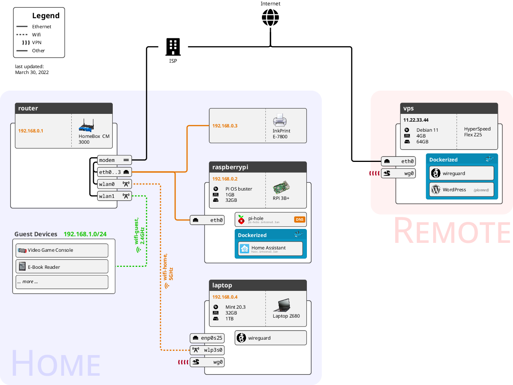

# Template for LaTeX-based Network Diagrams

Have fun!

* [Blogpost](https://mbugert.de/posts/2022-03-27-latex-home-network-diagram/)

## License
[CC BY 4.0](LICENSE.txt)

## Image credit
- [e-Book Reader](img/devices/my-ebook-reader-image.png): Webysther, CC BY-SA 4.0 <https://creativecommons.org/licenses/by-sa/4.0>, via Wikimedia Commons, https://commons.wikimedia.org/wiki/File:Webysther_20170725034326_-_Kindle_Paperwhite_2%C2%B0_gera%C3%A7%C3%A3o_com_4GB.png
- [Laptop](img/devices/my-laptop-image.png): Intel Free Press, CC BY-SA 2.0 <https://creativecommons.org/licenses/by-sa/2.0>, via Wikimedia Commons, https://commons.wikimedia.org/wiki/File:Lenovo_ThinkPad_X1_Ultrabook_(Nov_16,_2012).png
- [Modem](img/devices/my-router-image.png): Evan-Amos, Public domain, via Wikimedia Commons, https://commons.wikimedia.org/wiki/File:Linksys-Wireless-G-Router.jpg
- [Printer](img/devices/my-printer-image.png): David Vignoni / ICON KING (LGPL <http://www.gnu.org/licenses/lgpl.html> or LGPL <http://www.gnu.org/licenses/lgpl.html>), via Wikimedia Commons, https://commons.wikimedia.org/wiki/File:Nuvola_devices_print_printer.png
- [Raspberry Pi](img/devices/my-raspberry-pi-image.png): Gareth Halfacree from Bradford, UK, CC BY-SA 2.0 <https://creativecommons.org/licenses/by-sa/2.0>, via Wikimedia Commons, https://commons.wikimedia.org/wiki/File:Raspberry_Pi_3_B%2B_(26931245278).png
- [Video Game Console](img/devices/my-video-game-console-image.png): Evan-Amos, modified by Gunnar.offel, Public domain, via Wikimedia Commons, https://commons.wikimedia.org/wiki/File:Nintendo-Switch-wJoyCons-BlRd-Standing-FL.png

- [Docker](img/services/docker.png): dotCloud, Inc., Apache License 2.0 <http://www.apache.org/licenses/LICENSE-2.0>, via Wikimedia Commons, https://commons.wikimedia.org/wiki/File:Docker_(container_engine)_logo.svg
- [Home Assistant](img/services/homeassistant.png): Jeremy Geltman, CC BY-SA 4.0 <https://creativecommons.org/licenses/by-sa/4.0>, via Wikimedia Commons, https://commons.wikimedia.org/wiki/File:Home_Assistant_Logo.svg
- [pi-hole](img/services/pihole.png): fair use according to https://pi-hole.net/trademark-rules-and-brand-guidelines/
- [WireGuard](img/services/wireguard.png): CoreUI, CC BY 4.0 <https://creativecommons.org/licenses/by/4.0>, via Wikimedia Commons, https://commons.wikimedia.org/wiki/File:Cib-wireguard_(CoreUI_Icons_v1.0.0).svg
- [WordPress](img/services/wordpress.png): ™/®WordPress, GPL <http://www.gnu.org/licenses/gpl.html>, via Wikimedia Commons, https://commons.wikimedia.org/wiki/File:Wordpress-Logo.svg